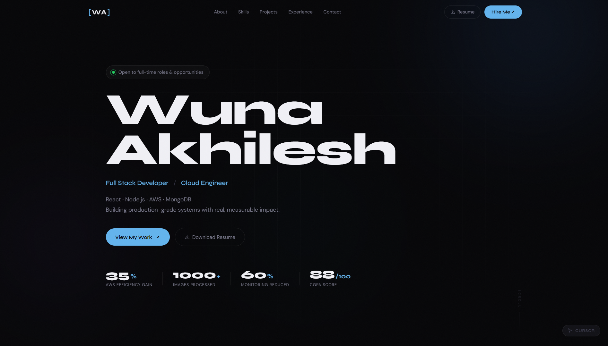

# 🌐 Wuna Akhilesh — Portfolio Website

A modern developer portfolio showcasing my projects, skills, and experience in building scalable web applications.

---

## 🚀 Live Demo

👉 https://akhilesh2209.github.io/portfolio/

---

## 🛠 Tech Stack

* HTML
* CSS
* JavaScript

---

## ✨ Features

* Fully responsive design (mobile + desktop)
* Smooth animations and modern UI
* Interactive project showcase with live demos
* Resume download functionality

---

## 📌 Featured Projects

### ✈️ SkyBook — Smart Flight Dashboard

* Advanced flight search, filtering, and comparison
* Intelligent recommendations and price insights
* Built using React.js with real-time state updates

### 🛫 Airline Reservation System

* Full-stack booking system with authentication and seat selection
* Built with Node.js, Express.js, and MongoDB

---

## 📸 Screenshots

---

## 👨‍💻 Author

**Wuna Akhilesh**
🔗 https://github.com/akhilesh2209

---

⭐ If you like this project, consider giving it a star!
